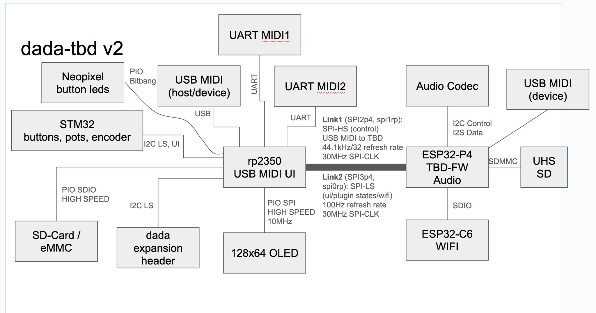

## Architecture Overview

## Pin Usage

| Function          | Processor | Pin | Mnemonic    | Peripheral | Connected to                        | Notes                                                       |
|-------------------|-----------|-----|-------------|------------|-------------------------------------|-------------------------------------------------------------|
| Audio Codec       | P4        | 7   | I2C_SDA     | I2C_NUM_1  | CODEC AIC3254                       | I2C data line                                               |
| Audio Codec       | P4        | 8   | I2C_SCL     | I2C_NUM_1  | CODEC AIC3254                       | I2C clock line                                              |
| Audio Codec       | P4        | 9   | I2S_DIN     | I2S_NUM_0  | CODEC AIC3254                       | I2S data in                                                 |
| Audio Codec       | P4        | 10  | I2S_WS      | I2S_NUM_0  | CODEC AIC3254, RP2350, UI Expansion | I2S word select                                             |
| Audio Codec       | P4        | 11  | I2S_DOUT    | I2S_NUM_0  | CODEC AIC3254                       | I2S data out                                                |
| Audio Codec       | P4        | 12  | I2S_BCLK    | I2S_NUM_0  | CODEC AIC3254                       | I2S bit clock                                               |
| Audio Codec       | P4        | 13  | I2S_MCLK    | I2S_NUM_0  | CODEC AIC3254                       | I2S master clock                                            |
| Real-time control | P4        | 28  | SPI_CS      | SPI2_HOST  | RP2350                              | spi1 of RP2350 for real-time control data                   |
| Real-time control | P4        | 30  | SPI_SCLK    | SPI2_HOST  | RP2350                              | spi1 of RP2350 for real-time control data                   |
| Real-time control | P4        | 31  | SPI_MOSI    | SPI2_HOST  | RP2350                              | spi1 of RP2350 for real-time control data                   |
| Real-time control | P4        | 29  | SPI_MISO    | SPI2_HOST  | RP2350                              | spi1 of RP2350 for real-time control data                   |
| State-api control | P4        | 20  | SPI_CS      | SPI3_HOST  | RP2350                              | spi0 of RP2350 for state api data                           |
| State-api control | P4        | 21  | SPI_SCLK    | SPI3_HOST  | RP2350                              | spi0 of RP2350 for state api data                           |
| State-api control | P4        | 23  | SPI_MOSI    | SPI3_HOST  | RP2350                              | spi0 of RP2350 for state api data                           |
| State-api control | P4        | 22  | SPI_MISO    | SPI3_HOST  | RP2350                              | spi0 of RP2350 for state api data                           |
| WiFi              | P4        | 54  | SDIO_RST    | SDIO       | C6                                  | esp_hosted reset                                            |
| WiFi              | P4        | 14  | SDIO_D0     | SDIO       | C6                                  | esp_hosted wifi                                             |
| WiFi              | P4        | 15  | SDIO_D1     | SDIO       | C6                                  | esp_hosted wifi                                             |
| WiFi              | P4        | 16  | SDIO_D2     | SDIO       | C6                                  | esp_hosted wifi                                             |
| WiFi              | P4        | 17  | SDIO_D3     | SDIO       | C6                                  | esp_hosted wifi                                             |
| WiFi              | P4        | 18  | SDIO_CLK    | SDIO       | C6                                  | esp_hosted wifi                                             |
| WiFi              | P4        | 19  | SDIO_CMD    | SDIO       | C6                                  | esp_hosted wifi                                             |
| SD-Card           | P4        | 39  | SDIO_D0     | SDMMC      | SD-Card                             | P4 sd-card                                                  |
| SD-Card           | P4        | 40  | SDIO_D1     | SDMMC      | SD-Card                             | P4 sd-card                                                  |
| SD-Card           | P4        | 41  | SDIO_D2     | SDMMC      | SD-Card                             | P4 sd-card                                                  |
| SD-Card           | P4        | 42  | SDIO_D3     | SDMMC      | SD-Card                             | P4 sd-card                                                  |
| SD-Card           | P4        | 43  | SDIO_CLK    | SDMMC      | SD-Card                             | P4 sd-card                                                  |
| SD-Card           | P4        | 44  | SDIO_CMD    | SDMMC      | SD-Card                             | P4 sd-card                                                  |
| Debug             | P4        | 2   | GPIO        | GPIO       | HEADER                              | Special pin out on debug header                             |
| Reset             | P4        | 4   | GPIO_OUT    | GPIO       | RP2350 RESET                        | RP2350 reset from P4                                        |
| Neopixel          | P4        | 6   | GPIO_OUT    | GPIO       | NEOPIXEL                            | P4 Neopixel                                                 |
| State-api control | RP2350    | 32  | SPI_MISO    | spi0       | P4                                  | spi0 of RP2350 for state api data                           |
| State-api control | RP2350    | 33  | SPI_CS      | spi0       | P4                                  | spi0 of RP2350 for state api data                           |
| State-api control | RP2350    | 34  | SPI_SCLK    | spi0       | P4                                  | spi0 of RP2350 for state api data                           |
| State-api control | RP2350    | 35  | SPI_MOSI    | spi0       | P4                                  | spi0 of RP2350 for state api data                           |
| Real-time control | RP2350    | 28  | SPI_MISO    | spi0       | P4                                  | spi1 of RP2350 for real-time control data                   |
| Real-time control | RP2350    | 29  | SPI_CS      | spi0       | P4                                  | spi1 of RP2350 for real-time control data                   |
| Real-time control | RP2350    | 30  | SPI_SCLK    | spi0       | P4                                  | spi1 of RP2350 for real-time control data                   |
| Real-time control | RP2350    | 31  | SPI_MOSI    | spi0       | P4                                  | spi1 of RP2350 for real-time control data                   |
| OLED              | RP2350    | 16  | OLED_RESET  | GPIO       | OLED                                | OLED                                                        |
| OLED              | RP2350    | 12  | OLED_MISO   | PIO_SPI    | OLED                                | OLED                                                        |
| OLED              | RP2350    | 13  | OLED_CS     | PIO_SPI    | OLED                                | OLED                                                        |
| OLED              | RP2350    | 14  | OLED_SCLK   | PIO_SPI    | OLED                                | OLED                                                        |
| OLED              | RP2350    | 15  | OLED_MOSI   | PIO_SPI    | OLED                                | OLED                                                        |
| Debug / Expansion | RP2350    | 20  | I2C_SDA     | i2c0       | HEADER                              | Expansion header                                            |
| Debug / Expansion | RP2350    | 21  | I2C_SCL     | i2c0       | HEADER                              | Expansion header                                            |
| UI                | RP2350    | 38  | I2C_SDA     | i2c1       | STM32 (if UI)                       | UI Board I2C, e.g. STM32                                    |
| UI                | RP2350    | 39  | I2C_SCL     | i2c1       | STM32 (if UI)                       | UI Board I2C, e.g. STM32                                    |
| Debug / UI        | RP2350    | 24  | GPIO_OUT    | GPIO       | Green LED                           | Green LED                                                   |
| UI                | RP2350    | 25  | GPIO_IN     | GPIO       | Button                              | Favorite button                                             |
| UI                | RP2350    | 26  | GPIO_OUT    | GPIO       | NEOPIXEL                            | RP2350 Neopixel, can have multiple if UI                    |
| Chip Sync         | RP2350    | 27  | GPIO_IN     | GPIO       | P4                                  | Codec word select for synchronization between P4 and RP2350 |
| USB               | RP2350    | 9   | GPIO_IN     | GPIO       | USB-A Power Sense                   | Sense for USB-A power ok                                    |
| USB               | RP2350    | 10  | GPIO_OUT    | GPIO       | USB-A Power Enable                  | USB-A power enable                                          |
| USB               | RP2350    | 11  | GPIO_OUT    | GPIO       | USB-A Select                        | 1 -> USB-A selected, 0 -> USB-C selected                    |
| SD-Card           | RP2350    | 2   | SDIO_CLK    | SDIO       | SD-Card                             | RP2350 sd-card                                              |
| SD-Card           | RP2350    | 3   | SDIO_CMD    | SDIO       | SD-Card                             | RP2350 sd-card                                              |
| SD-Card           | RP2350    | 4   | SDIO_D0     | SDIO       | SD-Card                             | RP2350 sd-card                                              |
| SD-Card           | RP2350    | 5   | SDIO_D1     | SDIO       | SD-Card                             | RP2350 sd-card                                              |
| SD-Card           | RP2350    | 6   | SDIO_D2     | SDIO       | SD-Card                             | RP2350 sd-card                                              |
| SD-Card           | RP2350    | 7   | SDIO_D3     | SDIO       | SD-Card                             | RP2350 sd-card                                              |
| SD-Card           | RP2350    | 8   | SDIO_DETECT | GPIO       | SD-Card                             | RP2350 sd-card                                              |
| MIDI              | RP2350    | 44  | UART_TX     | uart0      | MIDI-OUT-2                          | MIDI out 2, Serial1                                         |
| MIDI              | RP2350    | 45  | UART_RX     | uart0      | MIDI-IN-2                           | MIDI in 2, Serial1                                          |
| MIDI              | RP2350    | 36  | UART_TX     | uart1      | MIDI-OUT-1                          | MIDI out 1, Serial2                                         |
| MIDI              | RP2350    | 37  | UART_RX     | uart1      | MIDI-IN-1                           | MIDI in 1, Serial2                                          |

